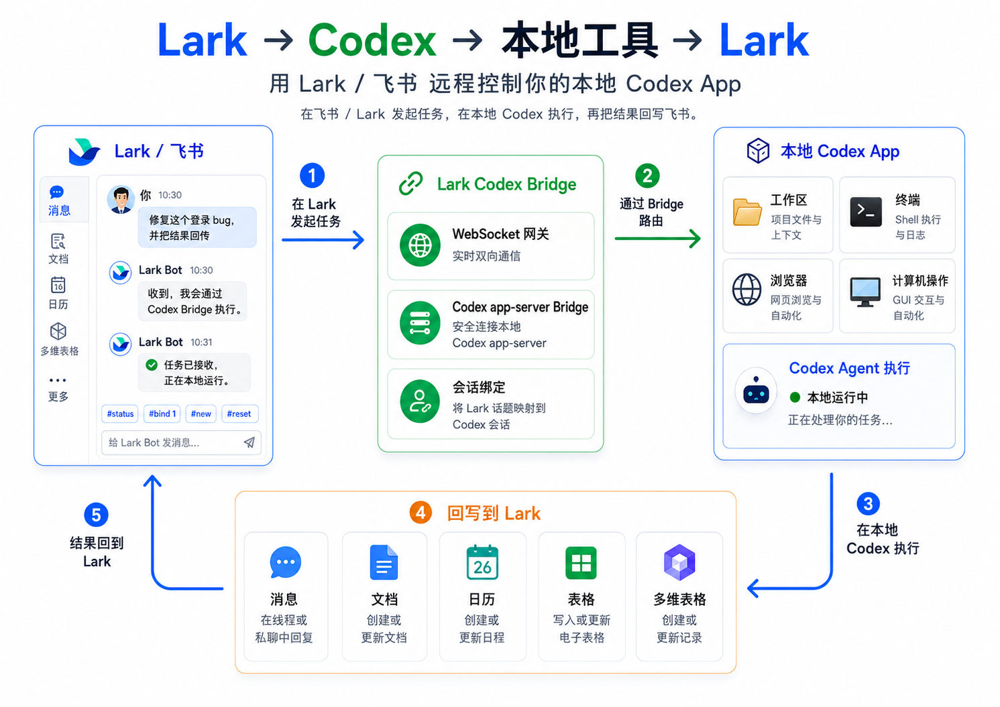
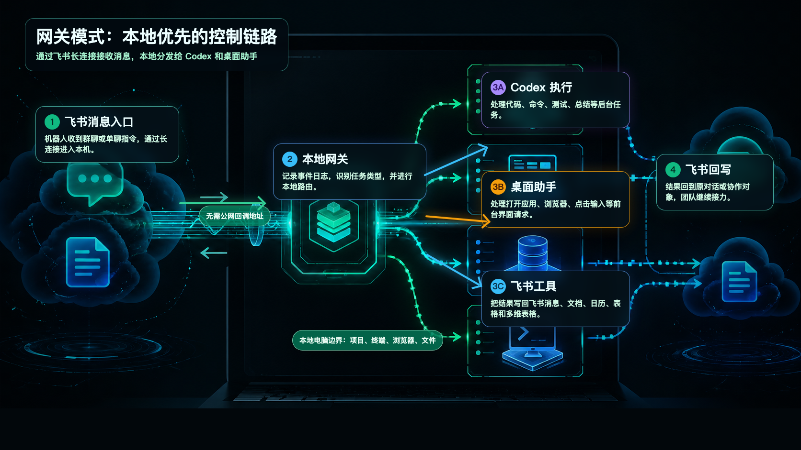

# lark-cli-codex-app

> 在飞书/Lark 里远程驱动本地 Codex App —— 通过 WebSocket 网关、Codex app-server bridge 和桌面任务队列，打通「聊天发起任务、本地执行、结果回写飞书」的完整闭环。
>
> Drive your local **Codex App** from **Feishu / Lark**. A WebSocket gateway, a `codex app-server` bridge, and a desktop task queue that close the full chat-to-agent loop — send a task from chat, run it locally, and write results back to Feishu / Lark.

`lark-cli-codex-app` 是一个用飞书/Lark **远程控制本地 Codex App** 的项目。它基于 [`yjwong/lark-cli`](https://github.com/yjwong/lark-cli)，保留上游的 Go CLI 和 skill 定义，并补充了 Codex 插件元数据、本地安装脚本、飞书/Lark WebSocket 网关、`codex app-server` bridge 和桌面任务队列。

它的目标不是重新实现一个 agent runtime，而是把飞书/Lark 接入为 Codex App 的远程入口和协作回写界面：

```text
人在飞书/Lark 中发起任务
  -> lark gateway / webhook 接收消息事件
  -> 本地 Codex app-server bridge 执行任务
  -> Codex 使用本地文件、终端、浏览器、computer use 和 skills
  -> Codex 使用 lark-cli 操作飞书/Lark
  -> 结果回写到飞书/Lark 对话、文档、日历、表格或多维表格
```



## 目录

- [项目定位](#项目定位)
- [功能概览](#功能概览)
- [快速开始](#快速开始)
- [Codex 插件安装](#codex-插件安装)
- [本地 Bridge](#本地-bridge)
- [Gateway 模式](#gateway-模式)
- [Webhook 模式](#webhook-模式)
- [Skills](#skills)
- [开发](#开发)
- [排障](#排障)
- [交流与社群](#交流与社群)

## 项目定位

多数「聊天软件接 agent」的项目只解决单向链路：人在聊天软件里发消息，本地 agent 执行后把结果回复回来。

这个项目专注于把**飞书/Lark 变成本地 Codex App 的远程遥控器**，并形成完整闭环：

- **飞书/Lark 发起任务**：支持单聊、群聊、话题和移动端，随时随地把任务丢给本机 Codex App。
- **Codex App 本机执行**：默认通过长驻 `codex app-server` 执行任务，保留 `codex exec` 兼容回退。
- **本地上下文可用**：Codex 可以读取 workspace、运行测试、操作终端、浏览器和本机应用（computer use）。
- **飞书/Lark 回写**：通过 `lark-cli` 和内置 skills 读取或更新消息、文档、日历、表格、多维表格、邮件和妙记。
- **桌面 GUI 队列**：需要前台 GUI 权限的任务进入桌面队列，由本地 helper 处理。

边界划分：

```text
飞书/Lark：任务入口、团队协作、结果承接
Codex App：本地执行、代码理解、工具调用、computer use
lark-cli-codex-app：连接两边，维护本地闭环
```

## 功能概览

- **Calendar**：列出、创建、更新、删除日程；查询忙闲；寻找共同空闲时间；回复邀请。
- **Contacts**：按 ID 查询用户，按姓名搜索用户，列出部门成员。
- **Documents**：读取飞书文档 Markdown，列出文件夹，浏览知识库节点。
- **Messages**：读取聊天历史，下载附件，发送消息，管理表情回应。
- **Gateway**：通过飞书/Lark WebSocket 长连接在本地接收机器人消息事件。
- **Agent Bridge**：将飞书消息分发给 Codex app-server，并把执行结果回复到聊天中。
- **Desktop Queue**：将桌面 GUI 请求转交给前台 Codex Desktop 会话或本地 helper。
- **Webhook**：在需要 callback 模式时提供本地 webhook server。
- **Mail**：通过 IMAP 本地缓存读取和搜索邮件。
- **Minutes**：获取会议录制信息，导出转写文本，下载音视频。
- **Sheets**：读取飞书电子表格元数据和内容。
- **Bitable**：查询飞书多维表格记录和元数据。

## 快速开始

### 1. 创建飞书/Lark 应用

在开放平台创建自建应用：

- 国际版 Lark：<https://open.larksuite.com>
- 飞书：中国区 <https://open.feishu.cn>

基础配置：

1. 添加 OAuth redirect URI：`http://localhost:9999/callback`
2. 在安全设置中启用 refresh token。
3. 记录 App ID 和 App Secret。
4. 按需要启用权限。详细权限清单见 [USAGE.md](./USAGE.md)。

### 2. 配置本地 CLI

```bash
cp config.example.yaml .lark/config.yaml
```

编辑 `.lark/config.yaml`：

```yaml
app_id: "cli_xxxxxxxxxx"
region: "lark" # 国际版 Lark 用 lark，飞书用 feishu
```

设置 App Secret：

```bash
export LARK_APP_SECRET="your_app_secret"
```

也可以把环境变量写入 `~/.lark/env.sh`，安装脚本生成的 wrapper 会自动加载它。

### 3. 构建并授权

```bash
make build
./lark auth login
./lark auth status
```

试运行：

```bash
./lark cal list --week
./lark auth scopes
```

完整 CLI 命令见 [USAGE.md](./USAGE.md)。

## Codex 插件安装

这个仓库包含 Codex 插件清单和 marketplace 元数据：

- [`.codex-plugin/plugin.json`](./.codex-plugin/plugin.json)
- [`.agents/plugins/marketplace.json`](./.agents/plugins/marketplace.json)
- [`skills/`](./skills/)
- [`scripts/install-codex-plugin.sh`](./scripts/install-codex-plugin.sh)

### 通过 Codex Plugin Marketplace 安装

推荐将本仓库作为 Git marketplace source 添加到 Codex：

```bash
codex plugin marketplace add git@github.com:RyanWeb31110/lark-cli-codex-app.git
```

如果本机没有配置 GitHub SSH，可以使用 HTTPS：

```bash
codex plugin marketplace add https://github.com/RyanWeb31110/lark-cli-codex-app.git
```

然后重启 Codex，在 Codex App 的 **Plugins** 中切换到 **Lark Codex App** marketplace，安装 **Lark Codex Bridge**。

本地开发调试也可以添加本地路径：

```bash
codex plugin marketplace add /path/to/lark-cli-codex-app
```

本地路径会显示为 local marketplace，Codex App 的 **Upgrade** 按钮不可用。

### 安装 CLI 和 Skills

构建 CLI，并将内置 skills 安装到本地 Codex home：

```bash
./scripts/install-codex-plugin.sh
```

默认行为：

- 构建 `lark` 到 `./lark`。
- 将二进制安装到 `~/.local/bin/lark`。
- 安装 wrapper，并自动加载 `~/.lark/env.sh`。
- 将内置 skills 复制到 `${CODEX_HOME:-~/.codex}/skills`。
- 检查 `lark auth status`。

覆盖已存在的 skills：

```bash
./scripts/install-codex-plugin.sh --force
```

安装后直接进入授权流程：

```bash
./scripts/install-codex-plugin.sh --login
```

安装后重启 Codex，让新的 skills 生效。

## 本地 Bridge

Bridge 用于把飞书消息路由到本地 Codex thread。安装 CLI 和 skills 后，可以用管理脚本启动后台服务：

```bash
./scripts/manage-bridge.sh install
./scripts/manage-bridge.sh start
./scripts/manage-bridge.sh status
./scripts/manage-bridge.sh logs
./scripts/manage-bridge.sh restart
./scripts/manage-bridge.sh stop
```

Makefile 也提供了同样入口：

```bash
make bridge-restart
make bridge-status
make bridge-logs
```

常用环境变量：

```bash
LARK_AGENT_WORKSPACE="$HOME/WorkSpace" ./scripts/manage-bridge.sh restart
LARK_AGENT_BACKEND=app_server ./scripts/manage-bridge.sh restart
LARK_AGENT_BACKEND=codex_exec ./scripts/manage-bridge.sh restart
LARK_AGENT_REASONING_EFFORT=low ./scripts/manage-bridge.sh restart
```

默认后端是 `app_server`。它会复用长驻 `codex app-server`，比每次启动 `codex exec` 更适合聊天触发任务。

Bridge 会把飞书会话和 Codex thread 绑定到本地 JSON 文件，默认路径：

```text
~/.lark/codex-thread-bindings.json
```

飞书聊天里可用的控制命令：

```text
#status
#bind 1
#new
#reset
```

- `#status`：查看当前飞书话题/聊天连接的 Codex 会话；如果尚未连接，会列出最近可连接的 Codex 会话和摘要。
- `#bind 1`：连接 `#status` 列出的第 1 个 Codex 会话；也支持 `#bind <codex_thread_id>`。
- `#new`：新建一个持久 Codex thread 并连接当前飞书话题/聊天。
- `#reset`：断开当前飞书话题/聊天和 Codex 会话的连接。

注意：这不是接管 Codex App 当前 UI 输入框。飞书消息会通过 `codex app-server` 继续指定的底层 Codex thread；Codex App 已打开窗口是否实时刷新取决于 App 自身的前端订阅机制。

## Gateway 模式

Gateway 模式是推荐的本地控制方式。它使用飞书/Lark WebSocket 事件订阅，不需要公网 callback URL。



直接运行：

```bash
lark gateway serve
```

作为后台服务运行：

```bash
./scripts/manage-bridge.sh restart
```

常用参数：

```bash
lark gateway serve \
  --event-log ~/.lark/gateway-events.jsonl \
  --auto-reply-text "收到：{{text}}"
```

启用本地 Codex agent：

```bash
lark gateway serve \
  --agent \
  --agent-workspace ~/WorkSpace \
  --agent-backend app_server \
  --agent-reasoning-effort medium
```

Gateway 做的事情：

- 通过 outbound WebSocket 连接飞书/Lark。
- 接收 `im.message.receive_v1` 消息事件。
- 将收到的消息事件追加到本地 JSONL 日志。
- 可选：用机器人自动回复消息。
- 可选：将飞书消息分发给 Codex app-server 执行，并把结果回复到聊天中。
- 将显式 `/gui ...` 消息或自动识别出的桌面操作请求放入桌面任务队列。

开放平台配置：

1. 启用事件订阅，选择 **长连接 / WebSocket** 模式。
2. 订阅 `im.message.receive_v1`。
3. 确认机器人已加入目标聊天。
4. 在本地运行 `lark gateway serve` 或 bridge 管理脚本。

### 桌面 GUI 任务

Desktop GUI 请求会进入单独队列。仍然支持 `/gui ` 前缀，普通桌面请求也会被自动识别，例如：

```text
打开 Safari，然后访问 openai.com
```

这类请求会被 gateway 加入桌面任务队列，并回复 task id，而不是直接发送给后台 Codex agent bridge。

如需执行点击、输入等前台 GUI 操作，在有 GUI 权限的前台会话中运行：

```bash
lark desktop helper serve
```

桌面队列辅助命令：

```bash
lark desktop tasks pop
lark desktop tasks complete --id <task-id> --result "done" --reply
lark desktop tasks fail --id <task-id> --error "why" --reply
```

macOS 上，键盘驱动的 GUI 操作可能需要给运行 helper 的前台应用授予 Accessibility 权限，例如 Terminal 或 Codex Desktop。

## Webhook 模式

当明确需要 callback 模式时，可以使用本地 webhook server：

```bash
lark webhook serve
```

常用参数：

```bash
lark webhook serve \
  --listen 0.0.0.0:8080 \
  --path /webhook/feishu \
  --token your-verification-token \
  --auto-reply-text "收到：{{text}}"
```

Webhook 支持：

- 处理 URL verification 的 `challenge` 回调。
- 接收明文 `im.message.receive_v1` 事件。
- 将收到的消息事件追加到本地 JSONL 日志。
- 可选：用机器人回复收到的消息。

当前限制：

- 暂不支持加密 callback。本版本中请将飞书/Lark 后台的 **Encrypt Key** 留空。

典型配置：

1. 通过公网 HTTPS tunnel 或反向代理暴露本地 server。
2. 在飞书/Lark 应用后台将 request URL 设置为公网地址加 webhook path。
3. 如果后台配置了 verification token，请在 `webhook.verification_token` 或 `--token` 中使用相同值。
4. 订阅 `im.message.receive_v1`。
5. 将机器人加入目标聊天。

## Skills

预置 skill 定义位于 [`skills/`](./skills/)：

- `bitable`：读取多维表格 app 元数据和记录。
- `calendar`：管理日历事件，查询忙闲，回复邀请。
- `contacts`：查询用户和部门。
- `documents`：读取文档，列出文件夹，浏览知识库。
- `lark-bridge`：安装、启动、停止、查看和排查本地 Lark -> Codex bridge。
- `messages`：读取聊天记录，下载附件，向用户或群聊发送消息。
- `email`：通过 IMAP 本地缓存读取和搜索邮件。
- `minutes`：获取会议录制，导出转写文本，下载媒体。
- `sheets`：读取飞书电子表格数据。

如果不通过插件安装，也可以手动复制 skills：

```bash
# Codex 用户级
cp -r skills/* ~/.codex/skills/

# Claude Code 项目级
cp -r skills/* /path/to/your/project/.claude/skills/

# Claude Code 用户级
cp -r skills/* ~/.claude/skills/
```

Skills 默认假设 `lark` 已在 `PATH` 中。如果不在，可以：

1. 将 `lark` 所在目录加入 `PATH`。
2. 修改 skill 文件，使用 `lark` 的完整路径。
3. 设置 `LARK_CONFIG_DIR` 指向你的 `.lark/` 配置目录。

## 开发

常用命令：

```bash
make build      # 构建二进制到 ./lark
make test       # 运行 Go 测试
make install    # 安装到 $GOPATH/bin
make deps       # go mod tidy && go mod download
```

本地运行 CLI：

```bash
make run ARGS="auth status"
make run ARGS="cal list --week"
```

项目结构：

```text
.codex-plugin/   Codex 插件清单
.agents/         Codex marketplace 元数据
assets/          插件图标和 README 图片
internal/api/    飞书/Lark API 客户端封装
internal/agent/  Codex app-server / exec bridge
internal/cmd/    Cobra CLI 命令
internal/desktop 桌面任务队列
internal/gateway WebSocket gateway
internal/webhook Webhook server
scripts/         安装和 bridge 管理脚本
skills/          Codex / Claude Code skills
```

## 排障

### OAuth 未登录或权限不足

```bash
~/.local/bin/lark auth status
~/.local/bin/lark auth scopes
~/.local/bin/lark auth login --add --scopes messages,documents
```

### Bridge 没有响应

```bash
./scripts/manage-bridge.sh status
./scripts/manage-bridge.sh logs
./scripts/manage-bridge.sh restart
```

检查项：

- `LARK_APP_SECRET` 是否可被后台服务读取。
- `~/.lark/env.sh` 是否包含必要环境变量。
- 飞书开放平台是否启用了 WebSocket 事件订阅。
- 机器人是否已加入目标聊天。
- 是否订阅了 `im.message.receive_v1`。

### Codex App 没有实时显示飞书消息

这是预期限制。Bridge 写入的是底层 Codex thread，并尽量保持消息内容接近原始飞书输入；Codex App 当前窗口是否实时刷新取决于 App 前端订阅机制。

### Desktop helper 无法点击或输入

在 macOS 系统设置中给运行 helper 的前台应用授予 Accessibility 权限，例如 Terminal 或 Codex Desktop。后台 gateway 不应直接承担前台 GUI 操作。

## 交流与社群

欢迎扫码加入微信群 **「AI 工具交流」**，一起讨论飞书/Lark 控制 Codex App 的玩法、反馈问题和分享工作流：


> 群二维码有有效期（重新进入会更新）。如果已过期，欢迎在 [Issues](https://github.com/RyanWeb31110/lark-cli-codex-app/issues) 中留言获取最新入群方式。

## 许可证

MIT，详见 [LICENSE](./LICENSE)。

## 社区与致谢

本项目认可并感谢 [LINUX DO](https://linux.do) 社区对开源项目交流、试用反馈和公开讨论的支持。欢迎从社区讨论出发，一起把“飞书/Lark 控制 Codex App，Codex App 再回写飞书/Lark”的本地闭环工作流打磨得更稳定、更实用。
